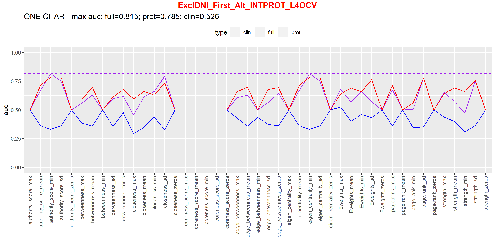
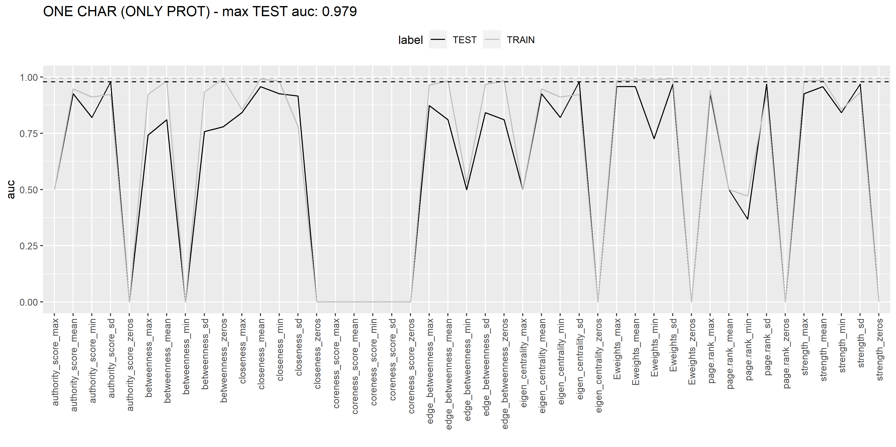

# EXCL
## FIRST
## ORIGINAL SET OF PROTEINS (Vadim's list)

Proteins

 
 
<pre>
"AHSG"     "APOB"     "C1QA"     "C1QB"     "C1QC"     "CRP"      "CST3"     "KLKB1"    "LYZ"      "ORM1"    
"PLG"      "SERPING1" "TF"       "TTR"      "VWF"      "CD14"     "PGLYRP2"  "SERPINA3"
</pre>

## OVERLAPPING PROTEINS (ZeBanC and Innsbruck)

Proteins

 
 
<pre>
"AHSG"     "APOB"     "C1QA"     "C1QB"     "C1QC"     "CRP"      "KLKB1"    "ORM1"     "PLG"      "SERPING1"
"TF"       "TTR"      "VWF"      "CD14"     "PGLYRP2"  "SERPINA3"
</pre>

