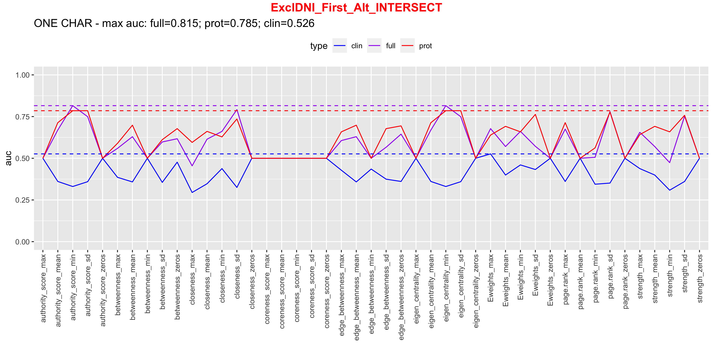
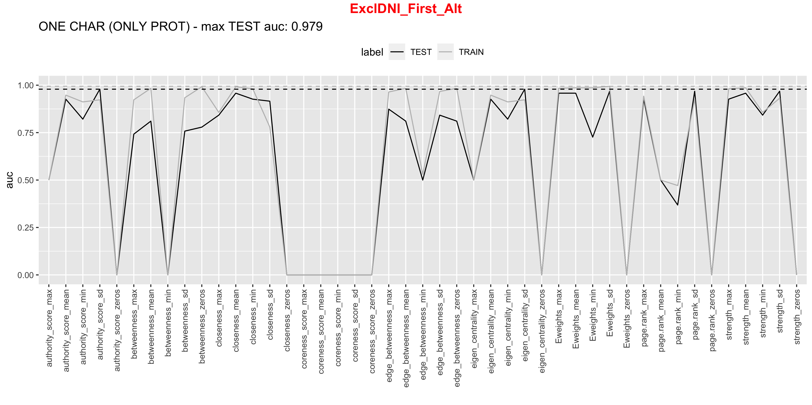
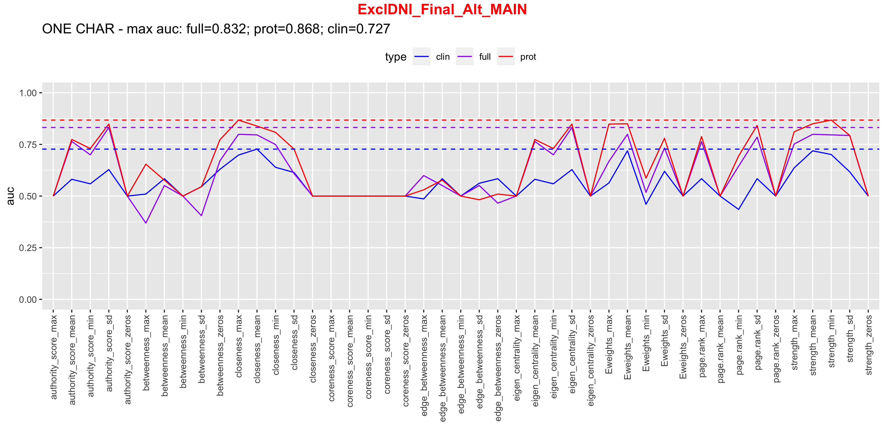
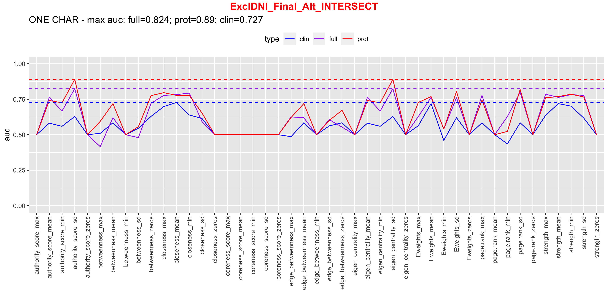
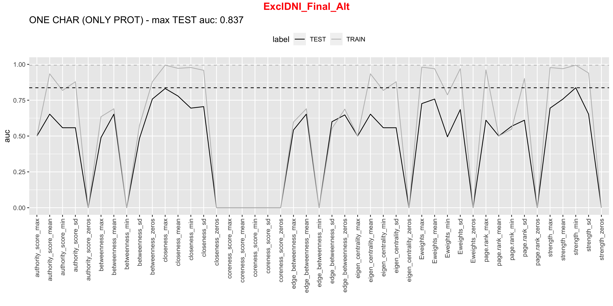

# EXCL
## FIRST
## ORIGINAL SET OF PROTEINS (Vadim's list)

(AHSG, APOB, C1QA, C1QB, C1QC, CRP, CST3, KLKB1, LYZ, ORM1, PLG, SERPING1, TF, TTR, VWF, CD14, PGLYRP2, SERPINA3)

## OVERLAPPING PROTEINS (ZeBanC and Innsbruck)

(AHSG, APOB, C1QA, C1QB, C1QC, CRP, KLKB1, ORM1, PLG, SERPING1, TF, TTR, VWF, CD14, PGLYRP2, SERPINA3)

## FINAL
## ORIGINAL SET OF PROTEINS (Vadim's list)

(AHSG, APOB, C1QA, C1QB, C1QC, CRP, CST3, KLKB1, LYZ, ORM1, PLG, SERPING1, TF, TTR, VWF, CD14, PGLYRP2, SERPINA3)

## OVERLAPPING PROTEINS (ZeBanC and Innsbruck)

(AHSG, APOB, C1QA, C1QB, C1QC, CRP, KLKB1, ORM1, PLG, SERPING1, TF, TTR, VWF, CD14, PGLYRP2, SERPINA3)

