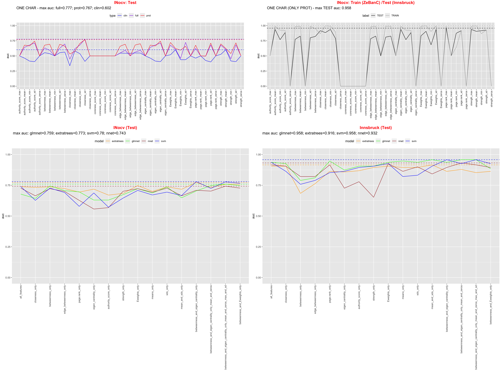
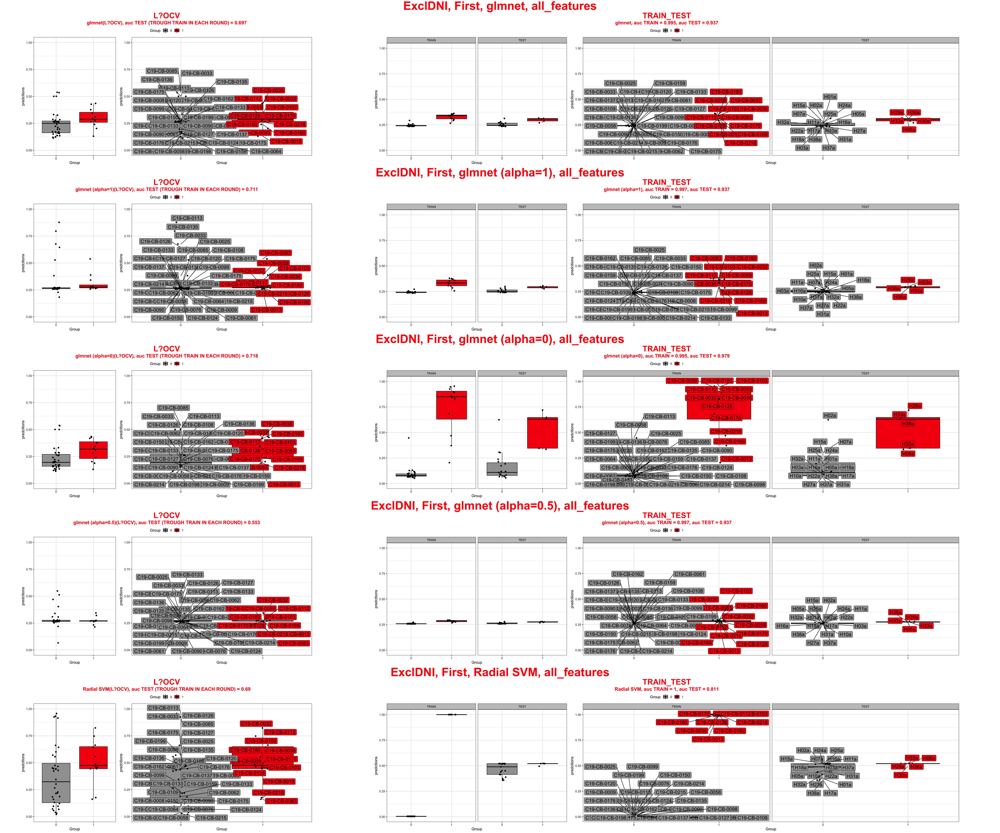
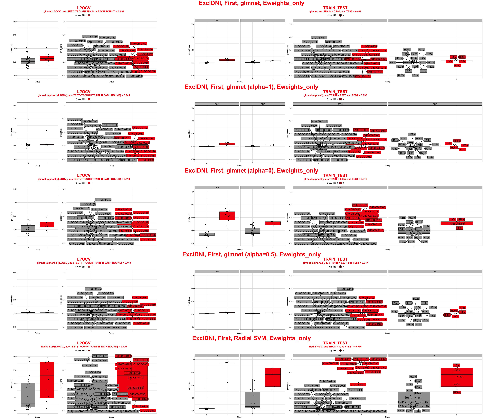

# EXCL/FIRST/WITH218/NEWLIST

# Main analysis

# Predcitions for "all network features" and "eweights only"
We are testing 5 models
- **glmnet** 
tunning parameters with cv on Train: alpha = seq(0, 1, length=10), lambda = seq(0.0001, 1, length = 100)
- **glmnet (fix alpha = 1)**
tunning parameters with cv on Train: alpha = 1, lambda = seq(0.0001, 1, length = 100)
- **glmnet (fix alpha = 0)**
tunning parameters with cv on Train: alpha = 0, lambda = seq(0.0001, 1, length = 100)
- **glmnet (fix alpha = 0.5)**
tunning parameters with cv on Train: alpha = 0.5, lambda = seq(0.0001, 1, length = 100)
- **Radial SVM**
tunning parameters with cv on Train: sigma= 2^c(-25, -20, -15,-10, -5, 0), C= 2^c(0:5)

## "all network features"

## "eweights only"

# NETWORKS

