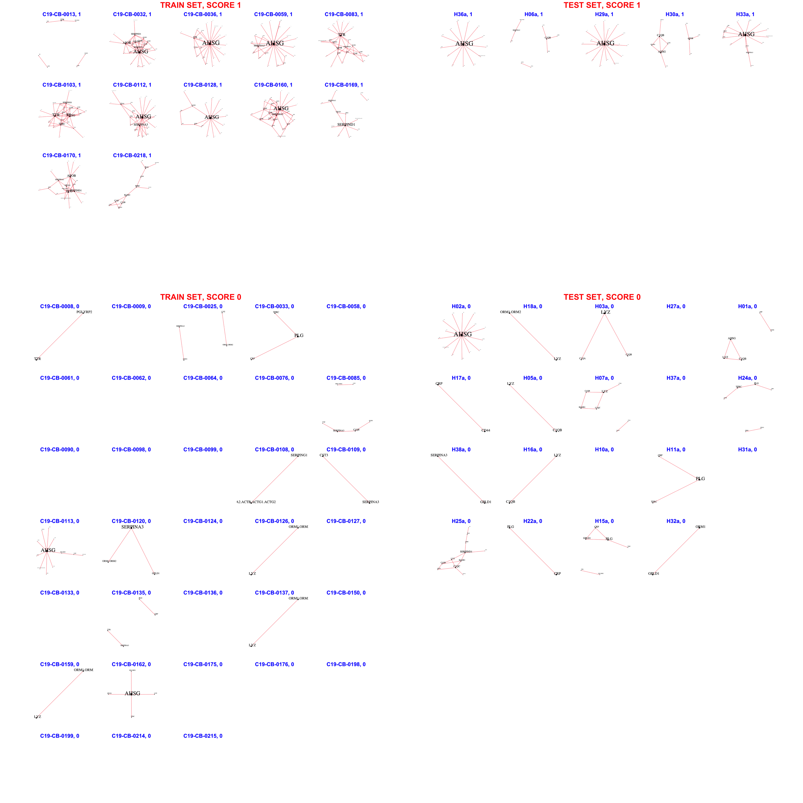

# EXCL/FIRST/WITH218/NEWLIST - BINAR

The **BINARY NETWORK** is created according to the rule: if the edge weight > 0.5, then there is an edge, otherwise it is not.

The **UNION CASES NETWORK** is created according to the rule: edge weight = fractions of TRAIN-CASE patients which have this edge in their BINARY NETWORKs;

The **IMPORTANT CASES NETWORK** is created according to the rule: if edge weight in UNION CASES NETWORK > 0.5 (i.e. more than 50% of TRAIN-CASE patients have this edge) then there is an edge, otherwise it is not.

Intersection BINARY NETWORKs of patients with IMPORTANT CASES NETWORK.

