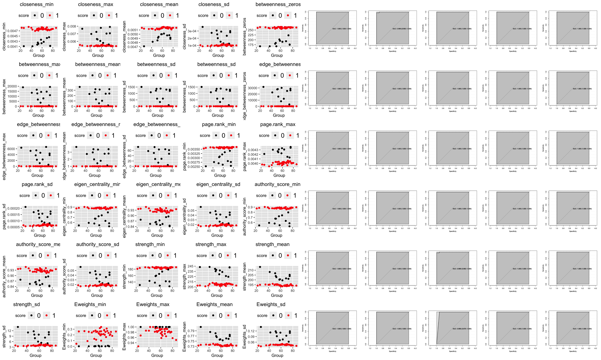
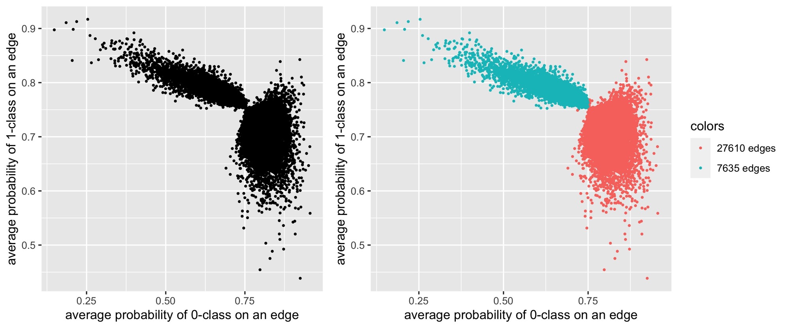
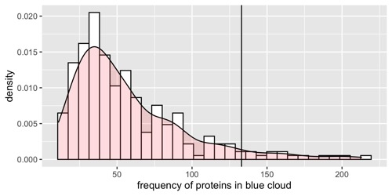
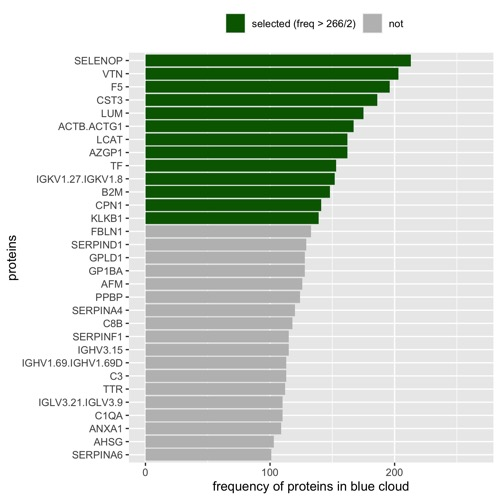
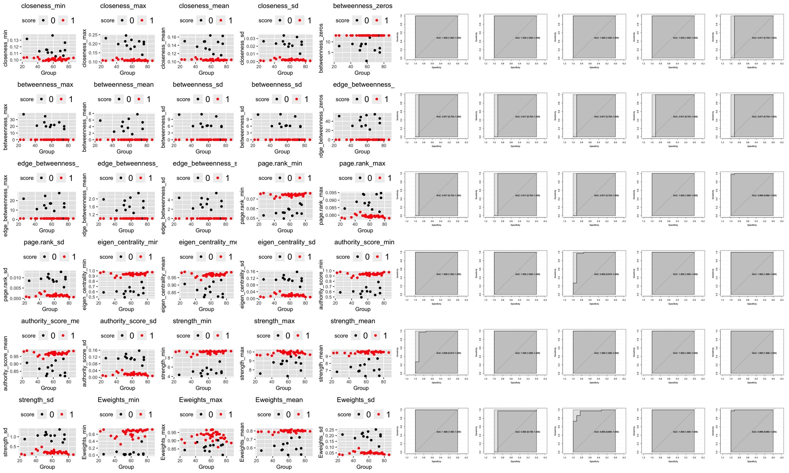
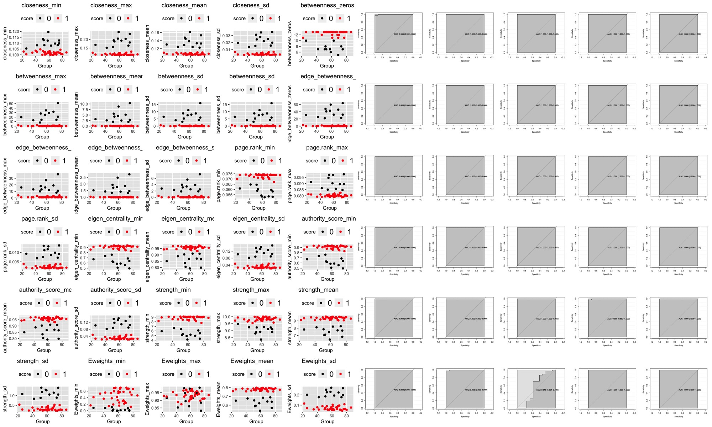

### Last Results (12.08.2020)
# Data: 
**266 proteins, 12 Controls, 37 Cases**
# Model:
- Internal (for each pair of proteins p1 and p2): radial SVM (crossvalidation) - weights of connection = probability to beloning class 1
```markdown
svmFit <- train(Group ~ p1 + p2 (or + AGE),
                  data = data, method = "svmRadial", preProc = c("center", "scale"),metric = "ROC",
                  trControl = trainControl(method = "cv", classProbs = TRUE, summaryFunction = twoClassSummary))
```
                                           
- External (for network characterisitcs): glm (LOOCV)
```markdown
glmFit <- train(Group ~ (1 network characterisitc),
                  data = data, method = "glm", preProc = c("center", "scale"), metric = "ROC",
                  trControl = trainControl(method = "LOOCV", classProbs = TRUE, summaryFunction = twoClassSummary))
```
# Results (Parenclitic WITH Age) 
_**35 245 edges** ~15 hours_


## Can we reduce number of proteins?
For each edge calculate avarage "weight" for 0-group and avarage "weight" for 1-group

Looks like "red cloud" - pairs of proteins where SVM didn't find solution (I think these guys were the ones who spoiled the previous models).

Calculation of how often each protein is found in the blue cloud (we think that if a protein is significant, then it will be found there more often, that is, the better other pairs with it will distinguish between groups).



I selected only those proteins if the number of their connections that got into the blue cloud is more than half of all proteins.


## Results of Parenclitic only on 13 proteins

Also perfect!

### Networks

Since in this _"weighted"_-model there is always an edge and edge has a positive weight, it is difficult to distinguish between the networks.
In these pictures, the edges have a thickness of their weight (that is, the probability of being a class) and I added colors to make the networks visually distinguishable:

- _red_ lines - weight of edge (0.75,1]
- _orange_ lines - weight of edge (0.5,75]
- _blue_ lines - weight of edge (0.25,5]
- _gray_ lines - weight of edge [0,0.25]

## Results of Parenclitic (WITHOUT AGE) only on 13 proteins (the same)
Also perfect (despite the fact that the proteins were chosen according to the model with age)

